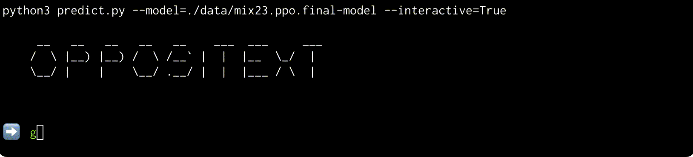
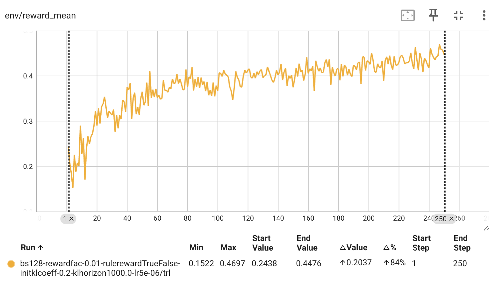

# OpposiText - Transformer for Generating "Opposite Text"

OpposiText is an encoder-decoder transformer model designed to generate
"opposite text" from a given input sentence. It is initially bootstrapped from
the [T5-Base](https://jmlr.org/papers/volume21/20-074/20-074.pdf) model using
labeled data via supervised fine-tuning (SFT). Further improvements are
achieved through a rule-based reward model and a reward model trained on
preference data using Proximal Policy Optimization (PPO) in a Reinforcement
Learning with Human Feedback (RLHF) framework.

The final model can be downloaded
[here](./data/mix24.base.model.ppo.ppo-step231.tar.gz). See
[LICENSE.md](./data/LICENSE.md) for detailed atrributions and licenses.

# Task Definition

The model generates sentences with an inverted, negated, or opposite meaning of
its input sentence:

1. For a simple sentence:
    * $opposite(\textnormal{"X is Y"})=\textnormal{"X is not Y"}$ or
    * $opposite(\textnormal{"X is Y"})=\textnormal{"X is Z"}$ where Z is an antonym of X.
2. For more complex sentences: When applying the $opposite(x)$ operation twice,
   it should (in principle) be possible to return back to the original
   input:
    * $opposite^2(X) = X$.
3. For questions, returning a different but similar question is sufficient.
4. As a guideline, the project focuses on sentences of up to 12 words.

(2) implies that the model should **avoid hallucinations and drifting** away too
far from the input sentence.

**Examples:**
* Good. $\rightarrow$ Bad.
* I am happy.	$\rightarrow$ I am sad.
* He is strong. $\rightarrow$ He is weak.
* Generate the opposite text. $\rightarrow$ Generate the same text.
* The weather is sunny. $\rightarrow$ The weather is rainy.
* Research took place in 2024 $\rightarrow$ Research didn't take place in 2024.

# Model

The model is bootstrapped from the
[T5-Base](https://jmlr.org/papers/volume21/20-074/20-074.pdf) encoder-decoder
model with approximately $220M$ parameters. The T5-Base model has a hidden size
of $768$, an inner layer size (feedforward network) of $3072$, $12$ attention
heads, and $12$ layers in both the encoder and decoder. (The early versions
were using T5-Small with $60M$ parameters.)

# Training

## Supervised Fine Tuning (SFT)

Setting up the training data was done in several iterations. The set of SFT
data was iteratively expanded. As unlabeled data, I use the
[Webis-Simple-Sentences-17 Corpus](https://zenodo.org/records/205950).

1. Bootstrap with a list of 750 antonyms (see [mix1.txt.gz](./data/mix1.txt.gz))
2. Iteratively generate output on a previously unlabeled data, handpick good responses using [./viewer_sft.py](./viewer_sft.py)

    File | Description | Examples
    ---|---|---
    [mix1.txt.gz](data/mix1.txt.gz) | single words | "good" $\rightarrow$ "bad"
    [mix3.txt.gz](data/mix3.txt.gz) | single words | "unlucky" $\rightarrow$ "fortunate"
    [mix4.txt.gz](data/mix4.txt.gz) | simple phrases | "go to work" $\rightarrow$ "work from home"
    [mix5.txt.gz](data/mix5.txt.gz) | more sentences | "This is the preferred method." $\rightarrow$ "This method is not preferred."
    ...|...|...
    [mix23.txt.gz](data/mix23.txt.gz) | longer sentences | "It may not have been pretty, but it still tasted good." $\rightarrow$ "It may have been pretty, but it still tasted bad."

These iterations could be done quickly using [./viewer_sft.py](./viewer_sft.py).

It displays predictions for a randomly chosen prompt and let's the user select
responses to be added to the training data.

## RLHF

The SFT trained model gets the basics right - but every now and then produces
output that doesn't follow the definition of the task:

1. Output is identical to the input sentence
2. Output is too far away from the input sentence
3. Output is ungrammatical
4. Other candidates would be a better answer

To counteract this, I implement and combine two reward models:
* A rule-based reward model to address (1) - (3)
* A classifier trained on preference data to address (4)

### Rule-Based Reward Model
This is implemented in [./rule-based-reward-model.py](./rule-based-reward-model.py):

By observing the undesired outputs, I came up with the following simple
rule-based reward model. It consists of two factors and is of the form:

$$\rho(\textnormal{input}, \textnormal{output}) = \alpha(\textnormal{input}, \textnormal{output}) \cdot \beta(\textnormal{input}, \textnormal{output})$$

* **Part 1: $\alpha(\textnormal{input}, \textnormal{output})$**
    * Are input and output non-identical?
    * Are the length of the input and output strings approximately equal?
    * Is punctuation in the input and output strings approximately equal?

    If all the conditions are fulfulled, then $\alpha=1.0$, otherwise its
    $\alpha=0.1$.

* **Part 2: $\beta(\textnormal{input}, \textnormal{output})$**
    * Not all the words should change (jaccard index over words)
    * No excessive repetition of words

    The value of $\beta$ ranges from $0.0$ to $2.0$, with $2.0$ indicating very
    similar inputs and outputs without excessive repetitions.

This overall rule reward is then $\alpha \cdot \beta$.

### ML Reward Model (trained on preference data)
This is implemented in [./train_reward.py](./train_reward.py) and
[./viewer_ppo.py](./viewer_ppo.py):

I train an ML-based reward model on preference data. For this, the SFT trained
T5 model is used, and a classification head is added. The classification head
is trained using a *Bradley Terry* loss on preference data, i.e. only the
*difference* of the model's output when comparing two examples is labeled.

To collect the training data, I implemented [./viewer_ppo.py](./viewer_ppo.py).
It randomly picks two responses for a given prompt. I can then select the
better one, or select none if I can't make a useful decision.

Using this data, the reward model is then trained using
[./train_reward.py](./train_reward.py)

For the candidate generation, I use a variety of different strategies. The most
important are:

* Sampled outputs from the SFT model
* Outputs with forced antonyms of words that are found in the prompt or the
  word "not" during decoding

Additionally, I also add synthetic bad examples. For a rated pair $(g,b)$
(g=good, b=bad, p=prompt):
* Add the pair (g, p) since using the prompt as output is always worse.
* Add the pair (g, p') with p' being the prompt with two input words merged ("I
  am" $\rightarrow$ "Iam"), since corrupting the input prompt is always worse
  than any other output.

During training of the reward model, I only train the weights of the
classification head. The rest of the SFT model weights stay fixed.

The preference data I collected/generated can be found in
[./data/mix24.reward.merged_ratings.db.gz](./data/mix24.reward.merged_ratings.db.gz)
(compressed sqlite3 database with tables `prompts`, `completions`, `ratings`
for SFT, and `comparisons` for preference data).

### Combining Reward Models
The reward models are combined: I use $1%$ of the rule-based reward model and
$99%$ of the ML-based reward model. However, if the rule-based reward model has
a very low score, the output of this combination is discounted by a factor of
$0.8$.

### Proximal Preference Optimization (PPO)
I then use PPO on the SFT model. This is implemented in
[./train_ppo.py](./train_ppo.py). I extract a mix of prompts of various lengths
from the [Webis-Simple-Sentences-17 Corpus](https://zenodo.org/records/205950)
using [./ppo_mix.sh](./ppo_mix.sh).

The screenshot below shows how the average reward, starting from just the SFT
model with $0.2438$ is improved to $0.4697$!

# Evals
For a small [./evalset](./evalset), I run some manual comparisons of the
models trained at different stages:

* **SFT Mix1 vs SFT Mix23 ([./eval1.md](./eval1.md))**
    * **Winner 🏆: SFT Mix23**
    * Detailed Comparisons
        * SFT Mix23 wins 17/21 times 
        * Draw: 0/21 times
        * SFT Mix1 wins 4/21 times

* **SFT Mix23 vs RLHF Mix23 ([./eval2.md](./eval2.md))**
    * **Winner 🏆: PPO Mix23**
    * Detailed Comparisons
        *  PPO Mix23 wins 11/21 times
        *  Draw: 8/21 times
        *  SFT Mix23 wins 2/21

**Conclusion:**
**The overall winner 🏆 is: PPO Mix23.**

* Gathering more SFT training data improved the model over the initial limited
  SFT data.
* The model was further improved using PPO

